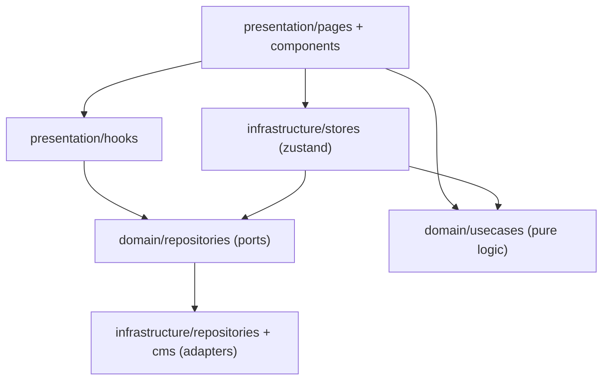
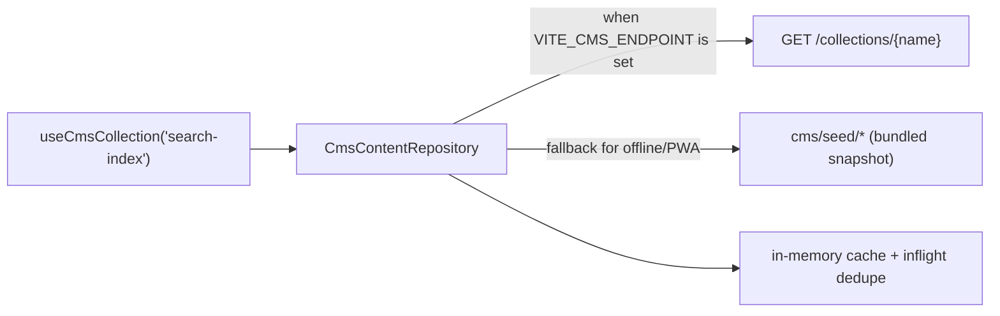
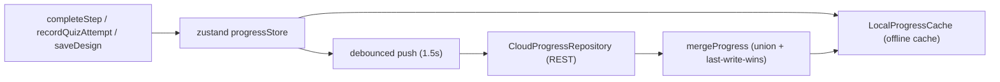

# 🏛️ Architecture & System Design - ArchAcademy

## 📌 1. Project Overview
ArchAcademy is a modern educational portal and knowledge graph designed to teach enterprise software architecture, cloud distributed systems, and design patterns.

## 🛠️ 2. Technology Stack
- **Framework**: React 19 + TypeScript (strict)
- **Bundler**: Vite 7
- **State**: Zustand (progress, system design sandbox)
- **Animations**: Framer Motion
- **Search**: Fuse.js (client-side fuzzy search over a CMS collection)
- **Internationalization**: i18next & i18next-browser-languagedetector
- **Icons**: Lucide React
- **Testing**: Vitest

## 📐 3. Layering

- `domain/` holds framework-free entities, repository ports and use cases. Nothing here imports React.
- `infrastructure/` implements those ports: CMS client, cloud progress repository, offline cache, Zustand stores, typed env config.
- `presentation/` holds pages, components and hooks. It depends on `domain` and on the composed infrastructure singletons.

## 🗂️ 4. Content Layer (CMS)

Content is no longer a hardcoded module. `src/presentation/data/searchIndex.ts` was removed and replaced by a `ContentRepository` port:

- `CmsContentRepository` resolves remote-first, validates the payload, caches per collection and falls back to the bundled seed on any failure.
- New collections are one line in `src/infrastructure/cms/seed/index.ts`.
- Presentation code never imports seed data directly, so a CMS can be introduced without touching components.

## ☁️ 5. Progress & Cloud Sync

`ProgressContext` is a thin adapter over `useProgressStore`; the store is the single source of truth.

- localStorage is **not** authoritative: it holds a cache envelope for offline startup and is overwritten by the cloud whenever the cloud is reachable.
- `mergeProgress` unions monotonic data (completed steps, designs by id) and resolves scalars (last visited, quiz result) by timestamp, keeping the best score per quiz.
- The legacy `arch_progress` key is migrated once and then deleted.
- Without `VITE_PROGRESS_SYNC_ENDPOINT` the app degrades to cache-only and still works fully offline.

## 🔒 6. Architecture Principles
1. **Single Source of Truth**: Typed domain entities plus explicit repository ports; infrastructure is swappable.
2. **Deterministic Offline Experience**: Service workers, the CMS seed snapshot and the progress cache keep the portal fully usable without a network.
3. **Pure Domain Logic**: Scoring, topology analysis, progress merging and ADR generation are pure functions with no React or I/O, so they are unit-testable in isolation.
4. **Smooth Micro-Interactions**: Framer Motion handles spring-based physics for modal transitions and graph rendering.
