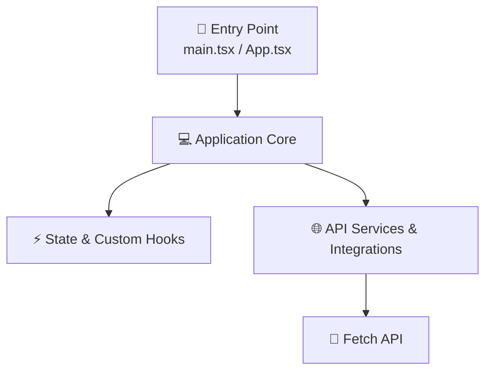

# 🤖 Architecture Overview (Auto-Generated)

> ⚡ **THIS FILE WAS AUTOMATICALLY GENERATED BY AN ARCHITECTURE SCAN SCRIPT.**  
> **Project Name**: `arch-academy`  
> **Version**: `1.0.0`  
> **Generated Date**: `2026-08-18 21:47`

---

## 📌 1. Executive Summary & Metrics

This document provides an automated architectural overview of the application source code structure.

### 📊 Codebase Statistics
- **Total Source Files**: `283`
- **Total Lines of Code (LOC)**: `41,142 lines`
- **UI Components**: `170 files`
- **Custom Hooks**: `3 files`
- **Services / API Handlers**: `0 files`

### 🛠️ Key Technology Stack
- **React**
- **React DOM**
- **Vite**
- **TypeScript**
- **Framer Motion**
- **Lucide Icons**
- **i18next**

---

## 🗺️ 2. Architectural Flow Diagram




---

## 🔌 3. Integrations, State & Environment

### ⚡ State Management Systems
- `LocalStorage`
- `Zustand`

### 🌐 API Services & Third-Party Integrations
- `Fetch API`

---

## 📂 4. `src/` Directory Tree

```text
src/
├── App.tsx
├── assets/
│   └── react.svg
├── data/
│   ├── assessmentQuestions.ts
│   └── leanPrinciplesData.ts
├── domain/
│   ├── entities/
│   ├── repositories/
│   └── usecases/
│       ├── ArchitectureCalculator.ts
│       └── SimulationUseCase.ts
├── i18n/
│   ├── index.ts
│   └── locales/
│       ├── en/
│       └── tr/
├── index.css
├── infrastructure/
│   ├── AcronymsData.ts
│   ├── ArchitectureData.ts
│   ├── ComparisonMatrixData.ts
│   ├── GlossaryData.ts
│   ├── config/
│   ├── data/
│   │   ├── collections/
│   │   └── defaults/
│   ├── database/
│   ├── repositories/
│   ├── services/
│   ├── storage/
│   └── stores/
├── main.tsx
├── presentation/
│   ├── components/
│   │   ├── AndroidPrinciples.tsx
│   │   ├── ArchHero.tsx
│   │   ├── ArchReferences.tsx
│   │   ├── ArchitectRoadmap.tsx
│   │   ├── ArchitecturalTruths.tsx
│   │   ├── ArchitectureFlow.tsx
│   │   ├── ArchitectureWizard.tsx
│   │   ├── AssessmentQuiz.tsx
│   │   ├── CQRSDiagram.tsx
│   │   ├── CQRSHero.tsx
│   │   ├── CQRSPractical.tsx
│   │   ├── CQRSSection.tsx
│   │   ├── Card.tsx
│   │   ├── CommandPalette.tsx
│   │   ├── ComparisonMatrix.tsx
│   │   ├── DDDHero.tsx
│   │   ├── DDDKeyConcepts.tsx
│   │   ├── DDDSection.tsx
│   │   ├── DDDSimulation.tsx
│   │   ├── EDADiagram.tsx
│   │   ├── EDAHero.tsx
│   │   ├── EDAPractical.tsx
│   │   ├── ErrorBoundary.tsx
│   │   ├── FSDDiagram.tsx
│   │   ├── FSDHero.tsx
│   │   ├── FSDPractical.tsx
│   │   ├── FeatureVsLayerDetail.tsx
│   │   ├── FlutterBestPractices.tsx
│   │   ├── FolderSurgery.tsx
│   │   ├── Footer.tsx
│   │   ├── Hero.tsx
│   │   ├── HexagonalDiagram.tsx
│   │   ├── HexagonalHero.tsx
│   │   ├── HexagonalPractical.tsx
│   │   ├── HomeHero.tsx
│   │   ├── HorizontalDiagram.tsx
│   │   ├── HorizontalHero.tsx
│   │   ├── HorizontalPractical.tsx
│   │   ├── MVVMFlow.tsx
│   │   ├── Navbar.tsx
│   │   ├── OnionDiagram.tsx
│   │   ├── OnionHero.tsx
│   │   ├── OnionPractical.tsx
│   │   ├── PageTemplate.tsx
│   │   ├── Practical.tsx
│   │   ├── ProductionFlow.tsx
│   │   ├── ProjectDecisionRecords.tsx
│   │   ├── ProjectDependency.tsx
│   │   ├── ProjectDesignSystem.tsx
│   │   ├── ProjectHero.tsx
│   │   ├── ProjectStructure.tsx
│   │   ├── ProjectTechStack.tsx
│   │   ├── RefactoringGuide.tsx
│   │   ├── RefactoringSurgery.tsx
│   │   ├── SEO.tsx
│   │   ├── SOLIDHero.tsx
│   │   ├── SOLIDSection.tsx
│   │   ├── ScreamingSection.tsx
│   │   ├── ScrollToTop.tsx
│   │   ├── Section.tsx
│   │   ├── SectionTitle.tsx
│   │   ├── StrategicDetails.tsx
│   │   ├── SystemChoice.tsx
│   │   ├── SystemComparison.tsx
│   │   ├── SystemHero.tsx
│   │   ├── Theory.tsx
│   │   ├── UncleBobStructure.tsx
│   │   ├── VerticalComparison.tsx
│   │   ├── VerticalHero.tsx
│   │   ├── VerticalPractical.tsx
│   │   ├── WhyLayered.tsx
│   │   ├── abstraction/
│   │   ├── acid/
│   │   ├── bff/
│   │   ├── broker/
│   │   ├── cap/
│   │   ├── choreography/
│   │   ├── cleanarch/
│   │   ├── cleancode/
│   │   ├── clientserver/
│   │   ├── ecs/
│   │   ├── elitearch/
│   │   ├── eventsourcing/
│   │   ├── gitops/
│   │   ├── interpreter/
│   │   ├── lambdakappa/
│   │   ├── lean/
│   │   ├── microkernel/
│   │   ├── mvc/
│   │   ├── mvi/
│   │   ├── mvp/
│   │   ├── mvvm/
│   │   ├── mvvmc/
│   │   ├── oop/
│   │   ├── p2p/
│   │   ├── pipefilter/
│   │   ├── plugin/
│   │   ├── primarysecondary/
│   │   ├── projectarch/
│   │   ├── pubsub/
│   │   ├── roadmap/
│   │   ├── robustness/
│   │   ├── serverless/
│   │   ├── soa/
│   │   ├── spacebased/
│   │   ├── spampa/
│   │   ├── synthesislab/
│   │   └── viper/
│   ├── context/
│   │   └── ProgressContext.tsx
│   ├── data/
│   │   └── searchIndex.ts
│   ├── hooks/
│   │   ├── useAssessmentQuiz.ts
│   │   └── useLocalStorage.ts
│   ├── locales/
│   │   └── en/
│   ├── navigation/
│   │   └── AppRouter.tsx
│   ├── pages/
│   │   ├── abstraction.tsx
│   │   ├── acid.tsx
│   │   ├── acronyms.tsx
│   │   ├── agentic-ai.tsx
│   │   ├── anti-patterns.tsx
│   │   ├── assessment.tsx
│   │   ├── atomic-design.tsx
│   │   ├── bff.tsx
│   │   ├── broker.tsx
│   │   ├── cap-theorem.tsx
│   │   ├── catalog.tsx
│   │   ├── choreography.tsx
│   │   ├── clean-arch.tsx
│   │   ├── clean-code.tsx
│   │   ├── client-server.tsx
│   │   ├── cloud-catalog.tsx
│   │   ├── compare.tsx
│   │   ├── component-driven.tsx
│   │   ├── component-state.tsx
│   │   ├── composite-ui.tsx
│   │   ├── containerization.tsx
│   │   ├── cqrs.tsx
│   │   ├── data-ai-catalog.tsx
│   │   ├── ddd.tsx
│   │   ├── dependency-management.tsx
│   │   ├── design-patterns.tsx
│   │   ├── design-tokens.tsx
│   │   ├── discipline-catalog.tsx
│   │   ├── docs-annotations.tsx
│   │   ├── ecs.tsx
│   │   ├── eda.tsx
│   │   ├── elite-architecture.tsx
│   │   ├── event-sourcing.tsx
│   │   ├── evolution.tsx
│   │   ├── fna-concept.tsx
│   │   ├── fsd.tsx
│   │   ├── gitops.tsx
│   │   ├── glossary.tsx
│   │   ├── hexagonal.tsx
│   │   ├── home.tsx
│   │   ├── horizontal.tsx
│   │   ├── interpreter.tsx
│   │   ├── islands-arch.tsx
│   │   ├── lambda-kappa.tsx
│   │   ├── lean-architecture.tsx
│   │   ├── library.tsx
│   │   ├── llm-ops.tsx
│   │   ├── micro-frontends.tsx
│   │   ├── microkernel.tsx
│   │   ├── microservices.tsx
│   │   ├── moderate-abstraction.tsx
│   │   ├── mvc.tsx
│   │   ├── mvi.tsx
│   │   ├── mvp.tsx
│   │   ├── mvvm-c.tsx
│   │   ├── mvvm.tsx
│   │   ├── not-found.tsx
│   │   ├── object-oriented.tsx
│   │   ├── onion.tsx
│   │   ├── oop-fundamentals.tsx
│   │   ├── orchestration.tsx
│   │   ├── p2p.tsx
│   │   ├── pipe-filter.tsx
│   │   ├── plugin.tsx
│   │   ├── primary-secondary.tsx
│   │   ├── project-arch.tsx
│   │   ├── pub-sub.tsx
│   │   ├── rag-arch.tsx
│   │   ├── refactoring.tsx
│   │   ├── roadmap.tsx
│   │   ├── robustness.tsx
│   │   ├── security.tsx
│   │   ├── server-driven-ui.tsx
│   │   ├── serverless.tsx
│   │   ├── soa.tsx
│   │   ├── solid.tsx
│   │   ├── spa-vs-mpa.tsx
│   │   ├── space-based.tsx
│   │   ├── state-driven.tsx
│   │   ├── synthesis-lab.tsx
│   │   ├── tdd.tsx
│   │   ├── testing.tsx
│   │   ├── ui-catalog.tsx
│   │   ├── vector-dbs.tsx
│   │   ├── vertical.tsx
│   │   ├── viper.tsx
│   │   ├── workshop.tsx
│   │   └── zero-trust.tsx
│   └── themes/
│       ├── theme.ts
│       └── typography.ts
└── tests/
    ├── components/
    │   ├── CommandPalette.test.tsx
    │   └── SEO.test.tsx
    ├── hooks/
    │   └── useLocalStorage.test.ts
    └── setup.ts
```

---

## 🔍 5. Core Modules & Directory Breakdown

### 🏁 Application Entry Points
- Core entry files: `App.tsx, main.tsx` 

### 📁 Primary Source Modules
| Directory | Purpose / Category | File Count |
| :--- | :--- | :--- |
| `src/assets/` | Assets components and modules | 1 files |
| `src/data/` | Data components and modules | 2 files |
| `src/domain/` | Domain components and modules | 0 files |
| `src/i18n/` | I18n components and modules | 1 files |
| `src/infrastructure/` | Infrastructure components and modules | 4 files |
| `src/presentation/` | Presentation components and modules | 0 files |
| `src/tests/` | Tests components and modules | 1 files |

---

## ⚙️ 6. Maintainability & Code Conventions

1. **Modular Architecture**: Separate UI components from business logic (`hooks/`, `services/`, `logic/`).
2. **Type Safety**: Maintain strict TypeScript interfaces in `src/types/` or `types.ts`.
3. **Environment Security**: Keep API keys in `.env` files and access via `process.env` or `import.meta.env`.

---
*Auto-generated by Architecture Scanner for `arch-academy`.*
